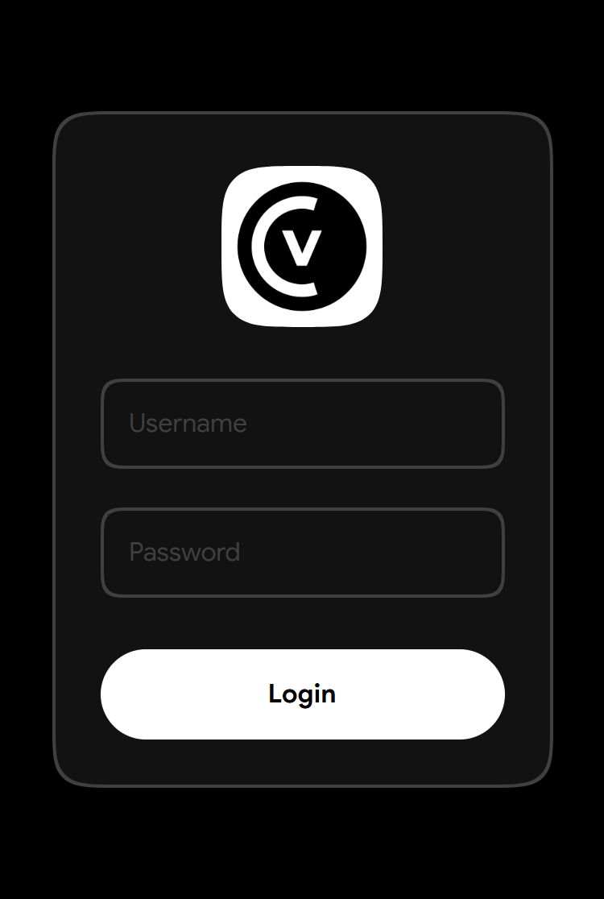
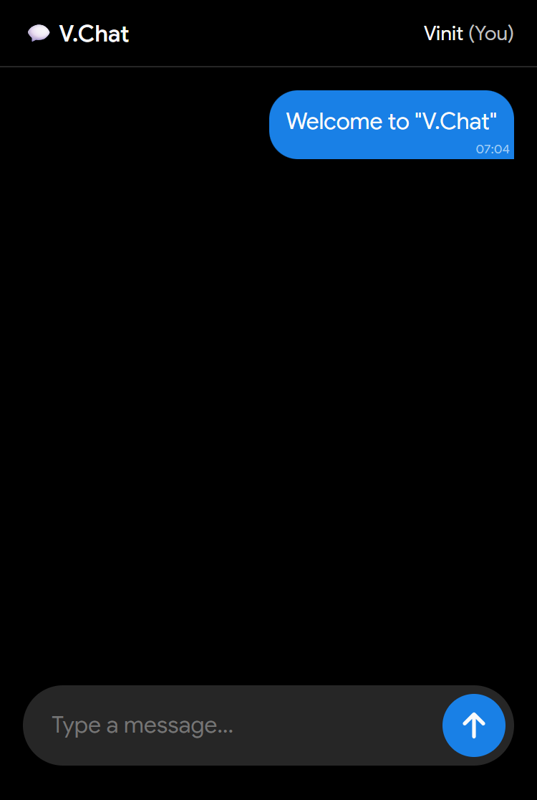

# V.Chat – Real-Time Text-Based Chat Application

V.Chat, also known as Vinit Chat, is a realtime text-based chatting web application developed by **Vinit Kumar Patwa**.  
It provides fast messaging performance, a clean modern interface, and secure backend integration using Firebase.

🌐 **Official App URL:**  
https://vinitkumarpatwa.netlify.app/apps/vchat/

⬇️ **Official Download Page:**  
https://vinitkumarpatwa.netlify.app/apps/vchat/download/

---

## 📸 Application Preview

  
  &nbsp;&nbsp;&nbsp;
  

---

## 🚀 Key Features

- ⚡ Realtime messaging system
- 🔐 Secure login authentication
- 🎨 Clean and minimal UI design
- 📱 Mobile-friendly responsive layout
- ☁️ Firebase Realtime Database integration
- 🚀 Fast loading via Netlify hosting

---

## 📥 Download V.Chat

To download the official version of V.Chat, visit:

👉 https://vinitkumarpatwa.netlify.app/apps/vchat/download/

Always download from the official source to ensure security, authenticity, and latest updates.

---

## 🛠️ Tech Stack

Frontend:
- HTML5
- CSS3
- JavaScript (Vanilla JS)

Backend:
- Firebase Realtime Database

Hosting:
- Netlify

---

## 🔒 Security & Privacy

V.Chat uses Firebase backend services for realtime communication.  
The system is designed to avoid unnecessary data storage and prioritizes lightweight architecture.

---

## 🎯 Project Objective

This project demonstrates:

- Practical frontend development
- Realtime database integration
- Authentication workflow implementation
- Production deployment experience
- SEO structure implementation

It serves as both a functional application and a portfolio-level technical project.

---

## 👨‍💻 Developer

**Vinit Kumar Patwa**  
Web Developer | Designer | Coder  
Nalanda, Bihar, India  

Portfolio:  
https://vinitkumarpatwa.netlify.app/

---

## 📌 Version Information

Current Version: 1.0  
Status: Stable Release  
Platform: Web Application

---

⭐ If you find this project useful, consider starring the repository.
